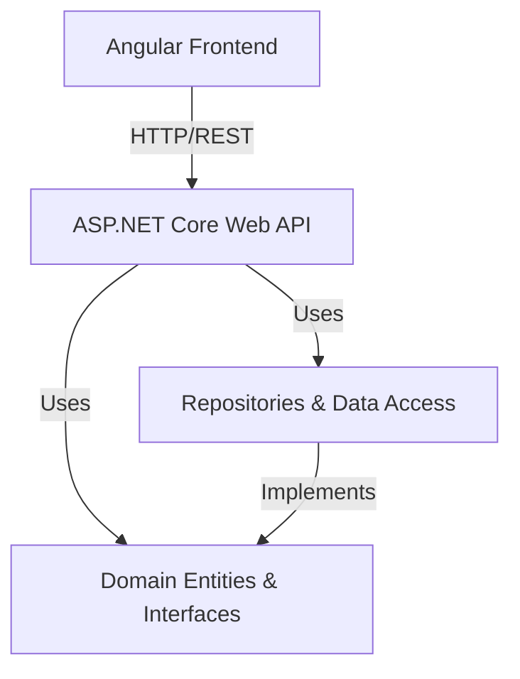

# Solution Overview

## Goal and Purpose

The Skinet solution is a modular e-commerce platform designed to provide a robust backend API, a flexible domain model, and a modern Angular frontend. It supports user authentication, product management, order processing, payments, and shopping cart functionality.

## Architecture

The solution is organized into four main projects:

- **API**: ASP.NET Core Web API exposing endpoints for authentication, product catalog, orders, payments, and shopping cart operations.
- **Core**: Contains domain entities, interfaces, and business logic specifications.
- **Infrastructure**: Implements data access, repositories, and external service integrations.
- **Client**: Angular application providing the user interface for shopping, account management, and order processing.

### Architecture Diagram (Mermaid)

## Main Components

- **API/Controllers**: Handle HTTP requests for accounts, admin, orders, products, payments, and shopping cart.
- **Core/Entities**: Define domain models such as Product, Order, User, ShoppingCart, etc.
- **Infrastructure/Repositories**: Implement data access patterns for entities.
- **Client/src/app**: Contains Angular components for shop, cart, orders, account, and shared UI elements.

## Features

- User registration and authentication
- Product catalog browsing and filtering
- Shopping cart management
- Order creation and tracking
- Payment processing
- Admin and account management

## Intended Use

This solution is intended as a scalable foundation for e-commerce applications, supporting extensibility and maintainability through a clean separation of concerns.

---

*Generated on: 2025-07-15 13:45:00*
